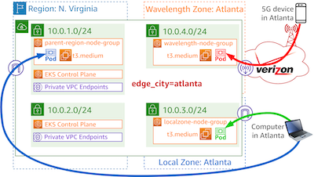

## Follow these steps to create an EKS-based distributed application

This will create node groups in the parent region, a local zone, and a wavelength zone

[](figure-1.png)

(click image to enlarge)

## Create EKS cluster

Change into the eks-cluster directory and create the EKS cluster infrastructure.

```
cd eks-cluster
terraform init
terraform apply -var=edge_city=losangeles -auto-approve
cd ..
```

## Create Kubernetes resources

Change into the kubernetes-config directory to apply Kubernetes resources to the new cluster.

```
cd kubernetes-config
terraform init
terraform apply -var=edge_city=losangeles -auto-approve
cd ..
```

## Create oidc (optional)

Change into the eks-oidc directory to apply Kubernetes resources to the new cluster.

```
cd eks-oidc
terraform init
terraform apply -var=edge_city=losangeles -auto-approve
cd ..
```

## Deleting the cluster

First, delete the OIDC resources as shown below (if you deployed this element)

```
cd eks-oidc
terraform destroy -var=edge_city=losangeles -auto-approve
cd ..
```

First, delete the Kubernetes resources as shown below. This will give Ingress and Service related Load Balancers a chance to delete before the other AWS resources are removed.

```
cd kubernetes-config
terraform destroy -var=edge_city=losangeles -auto-approve
cd ..
```

Then delete the EKS related resources:

```
cd eks-cluster
terraform destroy -var=edge_city=losangeles -auto-approve
cd ..
```
